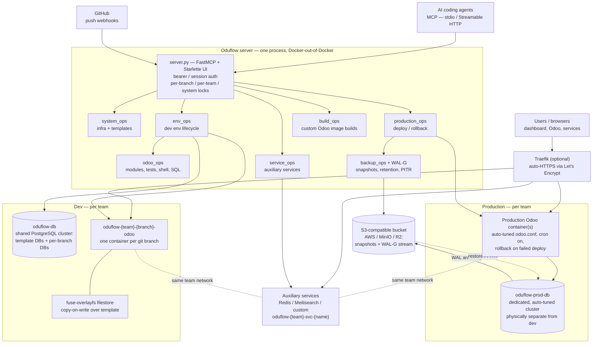
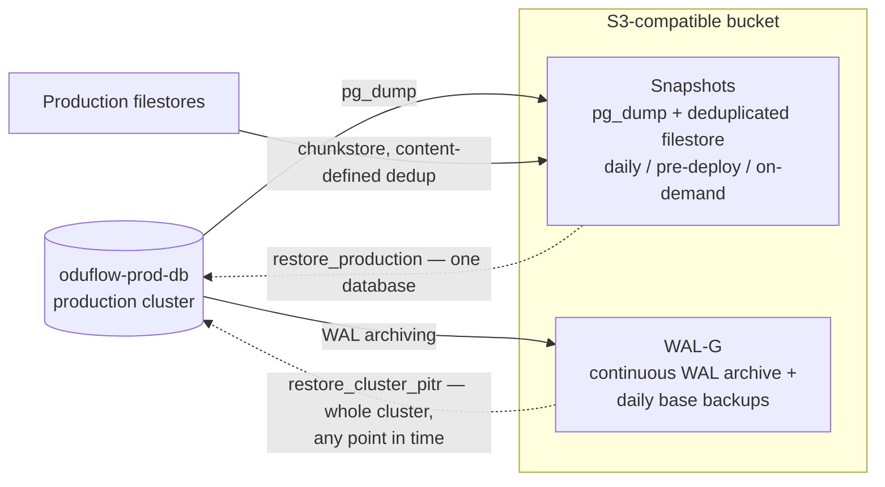

# Architecture

One picture of how Oduflow is put together: a single server process that
orchestrates everything over the Docker socket, two physically separate
PostgreSQL clusters (dev and production), per-branch dev environments,
production containers, shared auxiliary services, and an S3 bucket that holds
both logical snapshots and the WAL-G physical backup stream.

## System overview

How to read it, layer by layer:

- **Clients.** AI agents speak MCP to `server.py` (stdio for a single local
  user, Streamable HTTP for remote/multi-user); humans use the same process
  through the web dashboard and REST API; GitHub push webhooks drive
  auto-deploys. Everything funnels through one FastMCP + Starlette process
  guarded by granular locks — operations on different branches run in
  parallel, same-branch operations are serialised.
- **Ops modules.** The server never shells out to `docker`; each `*_ops`
  module drives the Docker SDK directly (Docker-out-of-Docker when Oduflow
  itself runs in a container). `build_ops` produces custom Odoo images used
  by templates and environments.
- **Dev.** One shared PostgreSQL cluster (`oduflow-db`) holds template
  databases plus a database per branch environment; each branch gets its own
  Odoo container, with large filestores shared copy-on-write via
  fuse-overlayfs. See [Environment Management](environments.md) and
  [Template Management](templates.md).
- **Production.** A dedicated, auto-tuned cluster (`oduflow-prod-db`) —
  physically separate from dev — backing production Odoo containers with
  deploy/rollback handled by `production_ops`. See
  [Production Hosting](production.md).
- **Auxiliary services.** Redis, Meilisearch, or any custom image, attached
  to the team network so both dev and production Odoo can reach them. See
  [Auxiliary Services](services.md).
- **Routing.** In Traefik mode, environments, productions, and services get
  automatic HTTPS hostnames; without it, Oduflow publishes stable per-branch
  ports. See [Traefik Routing](traefik.md).
- **Backups.** `backup_ops` and WAL-G push production data to an
  S3-compatible bucket on two independent paths — detailed in the next
  diagram.

## Backup and recovery

Production data leaves the host on two independent paths, both landing in the
same S3-compatible bucket (AWS S3, MinIO, Cloudflare R2, …):

- **Snapshots** are logical, per-database backups: a `pg_dump` plus the
  filestore deduplicated by the built-in chunkstore engine. They restore one
  production at a time (`restore_production`), including to a brand-new host.
- **WAL-G** continuously archives WAL and takes scheduled base backups of the
  whole production cluster. `restore_cluster_pitr` rewinds the entire cluster
  to an arbitrary point in time — the disaster-recovery path.
- Retention, scheduling, and pruning run in the server's background scheduler.
  Details in [Production Hosting](production.md#backups).

For the module-level view of the same system — file-by-file layout, locking,
error hierarchy — see [Internals](internals.md).
